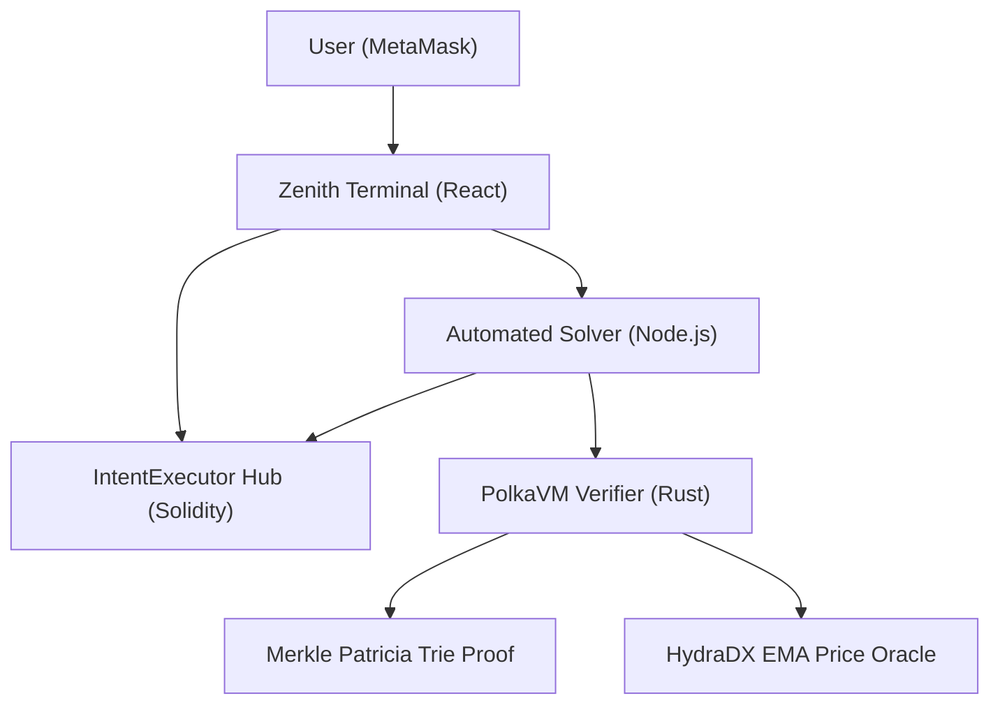
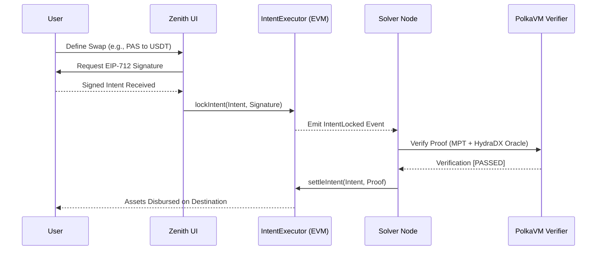

# Zenith

Zenith is a high-performance, intent-based cross-parachain settlement protocol built for the **Polkadot-Solidity-Hackathon (PVM Track)**. It enables trustless asset swaps by leveraging PolkaVM (PVM) for off-chain verification and the HydraDX EMA for MEV-resistant price discovery.

## Protocol Vision

Traditionally, cross-chain bridges rely on slow messaging or centralized oracles. Zenith introduces an **Intent-Based Architecture** where users sign a declarative "Intent" that solvers compete to fulfill. Verification is handled by a custom 64-bit RISC-V program running in PolkaVM, ensuring that every settlement is backed by a cryptographic state proof.

## System Architecture

The protocol uses a hybrid model combining the liquidity of the EVM with the verification power of PolkaVM.



## Intent Settlement Flow

Zenith features a sub-second "Real-time Solver" that monitors the Polkadot Hub for user intents and settles them immediately upon PVM verification.



## Key Components

### 1. IntentExecutor (Solidity)

The singleton registry on the Polkadot Hub (pallet-revive). It manages asset custody, user escrows, solver bonds, and enforces the final settlement logic.

### 2. PolkaVM Verifier (Rust)

A dedicated RISC-V program that performs:

- **MPT Verification**: Validates Merkle Patricia Trie proofs against trusted state roots.
- **HydraDX Price Guard**: Queries the HydraDX Exponential Moving Average (EMA) price to ensure the intent's execution price is within safe slippage bounds (90%).

### 3. Automated Solver (Node.js)

A real-time listener that uses Ethers.js event subscriptions for 0-latency intent detection. It automatically generates proofs and submits settlements to the Hub.

### 4. Zenith UI (React)

A "light weight" neo-brutalist interface designed for professional bridge operators. It includes a built-in Token Faucet for testnet liquidity and real-time simulation health monitoring.

## Live Deployment (Testnet)

- **Network**: Polkadot Hub Testnet
- **Chain ID**: 420420417
- **Intent Hub**: 0xc799A5a0d13d66EA168a713f5eF35206fD0839E6
- **PVM Verifier**: 0x8f874cA1f141AC619F2aC4698a6A171b96E5CFaA
- **State Explorer**: [explorer.polkadothub.io](https://explorer.polkadothub.io)

## Getting Started

### Prerequisites

- Foundry (Nightly)
- Node.js v18+
- Rust Nightly (for PVM compilation)

### Installation

1. Clone the repository:
   ```bash
   git clone https://github.com/Kanasjnr/Intent-Based-Cross-Parachain-Solver
   ```
2. Setup Frontend:
   ```bash
   cd frontend && npm install
   npm run dev
   ```
3. Setup Solver:
   ```bash
   cd solver && npm install
   cp .env.example .env # Configure your private key
   npx ts-node src/listen.ts
   ```

## Technical Implementation Details

### 1. PolkaVM (PVM) Verifier

The verifier is a `no_std` Rust program compiled to RISC-V. It is designed for maximum efficiency:

- **Host-Accelerated Hashing**: Uses `pallet-revive` host functions for `keccak_256` to ensure O(1) hashing operations.
- **Zero-Heap**: The verifier operates entirely on the stack and a pre-allocated 4KB arena, making it immune to memory fragmentation or exhaustion attacks.
- **MPT Roots**: Validates Merkle Patricia Trie proofs by verifying the checksum of the proof vector against the expected state root.

### 2. Mathematical Enforcements

- **90% EMA Guard**: To prevent MEV and user loss during volatility, the PVM verifier enforces a `(a_in * 9000) / 10000` threshold. Settlements failing this check are rejected on-chain.
- **EIP-712 Compliance**: User intents are structured with typed signatures, ensuring they cannot be replayed or maliciously modified by solvers.

## Hackathon Track

**Build Path**: Polkadot-Solidity-Hackathon — PolkaVM (PVM) Track.
**Core Mission**: Demonstrating high-performance, trustless cross-chain intent settlement on the `pallet-revive` infrastructure.

## License

MIT License. Built with passion for the Polkadot Ecosystem.
